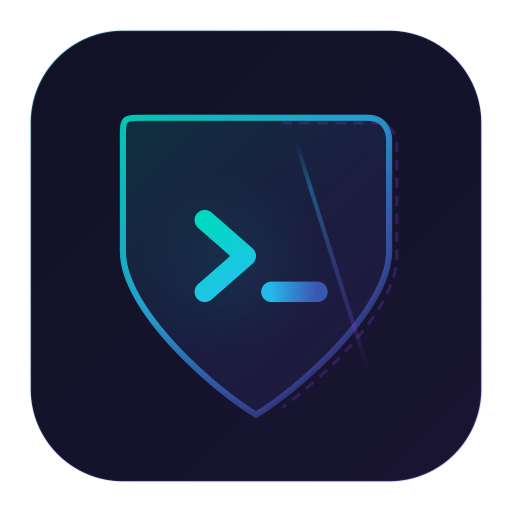
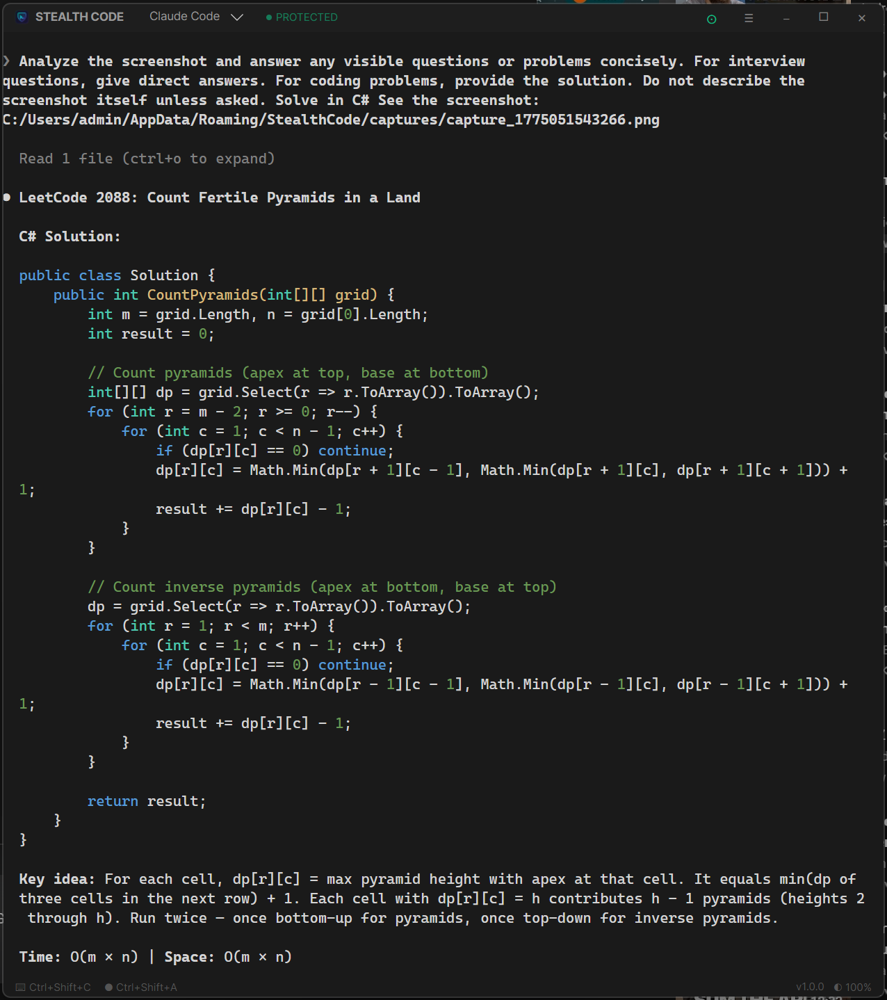
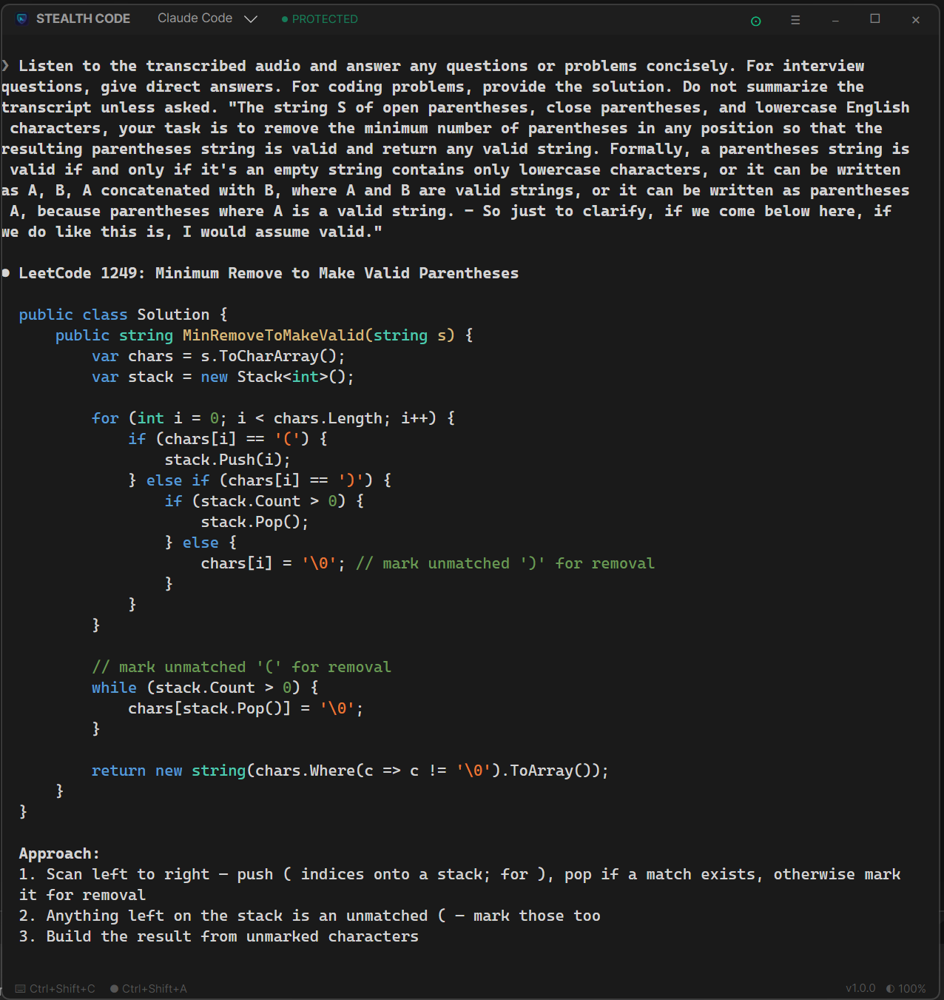
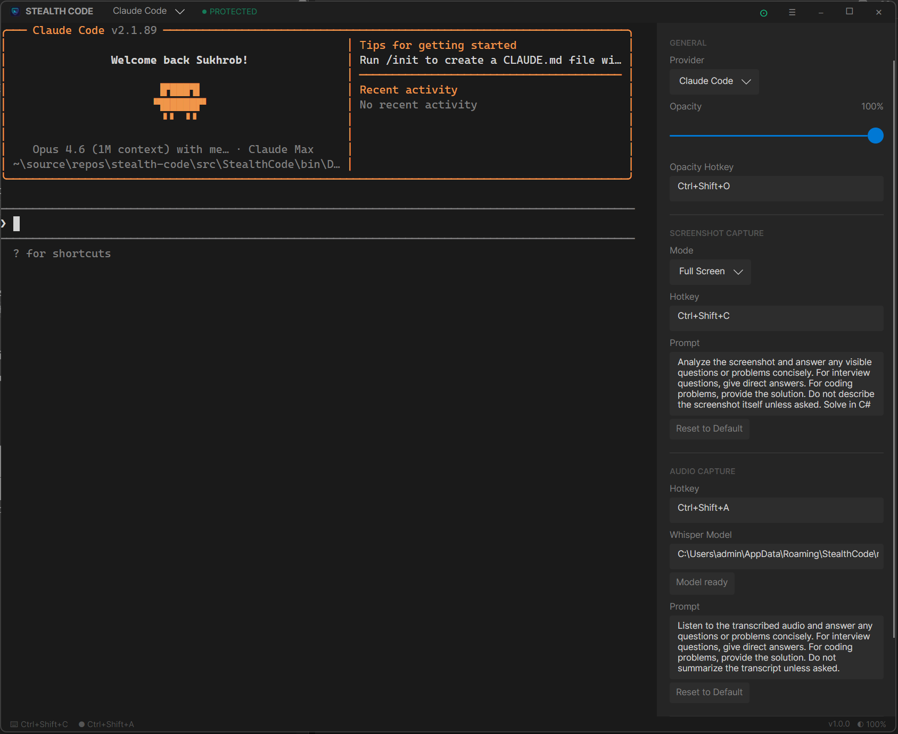

  

<h1 align="center">Stealth Code</h1>

  Run AI coding assistants in a screen-capture-proof overlay terminal.
   
  <strong>Invisible to screenshots, screen recordings, and screen sharing.</strong>

  
  
  
   
  
  
  

  

---

## Why Stealth Code?

Need to use AI coding tools during a screen share, interview prep, or recording session? Stealth Code gives you a full terminal that's **completely invisible** to any screen capture software - your secret coding companion that only you can see.

## Features

- **Screen capture protection** - Invisible to screenshots, screen recordings, and screen sharing
- **Always-on-top overlay** - Pin the terminal above other windows with adjustable opacity
- **Multiple AI CLIs** - Switch between Claude Code, Codex, and Gemini CLI from the title bar
- **Screenshot capture** - Capture your screen and inject it into the active CLI for instant AI analysis
- **Multi-capture mode** - Accumulate multiple screenshots (e.g., scrollable content) and send them all at once with overlap-aware prompting
- **No-focus mode** - Keep your browser focused while interacting with Stealth Code — clicks won't steal focus
- **Meeting audio capture** - Record system audio, transcribe locally with Whisper, and send to the CLI
- **Custom system prompts** - Set separate prompts for screenshot and audio captures to tailor AI responses (e.g., "solve in Python", "give direct answers")
- **Configurable hotkeys** - Global hotkeys for all actions, customizable in settings
- **Auto-updates** - Built-in update checker with one-click install
- **Lightweight** - Ships as a single portable executable, no installation needed

## Screenshots

<table>
  <tr>
    <td align="center"><strong>Screenshot Capture</strong></td>
    <td align="center"><strong>Audio Capture</strong></td>
  </tr>
  <tr>
    <td></td>
    <td></td>
  </tr>
  <tr>
    <td align="center"><em>Press <code>Ctrl+Shift+C</code> to capture your screen and inject it into the CLI. The AI sees the screenshot and responds with a solution - no copy-pasting needed.</em></td>
    <td align="center"><em>Press <code>Ctrl+Shift+A</code> to start recording system audio. Press again to stop - the audio is transcribed locally via Whisper and sent to the CLI automatically.</em></td>
  </tr>
  <tr>
    <td align="center" colspan="2"><strong>Settings Panel</strong></td>
  </tr>
  <tr>
    <td align="center" colspan="2"></td>
  </tr>
  <tr>
    <td align="center" colspan="2"><em>Configure capture mode, hotkeys, AI prompts, opacity, and audio model - all in one panel.</em></td>
  </tr>
</table>

## Getting Started

1. Download the latest release from the [Releases](https://github.com/suxrobGM/stealth-code/releases) page
2. Run `stealthcode.exe` - no installation needed
3. Make sure you have at least one supported CLI tool installed:
   - [Claude Code](https://docs.anthropic.com/en/docs/claude-code)
   - [Codex](https://github.com/openai/codex)
   - [Gemini CLI](https://github.com/google-gemini/gemini-cli)

> For building from source, see [Architecture](docs/architecture.md#build--run).

## Keyboard Shortcuts

| Action | Default Shortcut |
| --- | --- |
| Capture screenshot | `Ctrl+Shift+C` |
| Multi-capture (accumulate screenshots) | `Ctrl+Shift+X` |
| Record/stop audio | `Ctrl+Shift+A` |
| Cycle opacity | `Ctrl+Shift+O` |
| Toggle no-focus mode | `Ctrl+Shift+F` |

All hotkeys are customizable in the settings panel.

## Documentation

- [How It Works](docs/how-it-works.md) - screen protection, terminal emulator, capture pipeline, and more
- [Architecture](docs/architecture.md) - project structure, conventions, and build details
- [Changelog](CHANGELOG.md) - release history and notable changes

## License

[MIT](LICENSE) - Sukhrob Ilyosbekov
